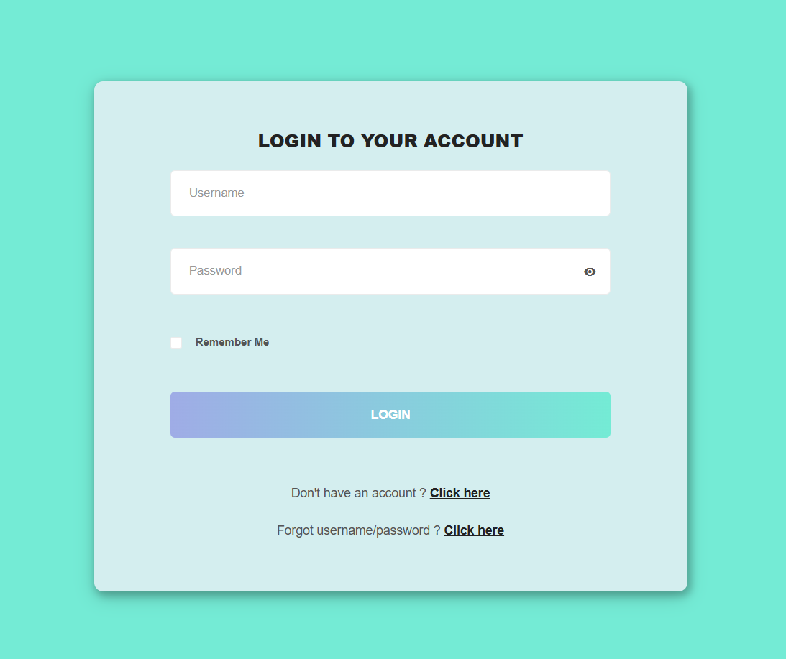
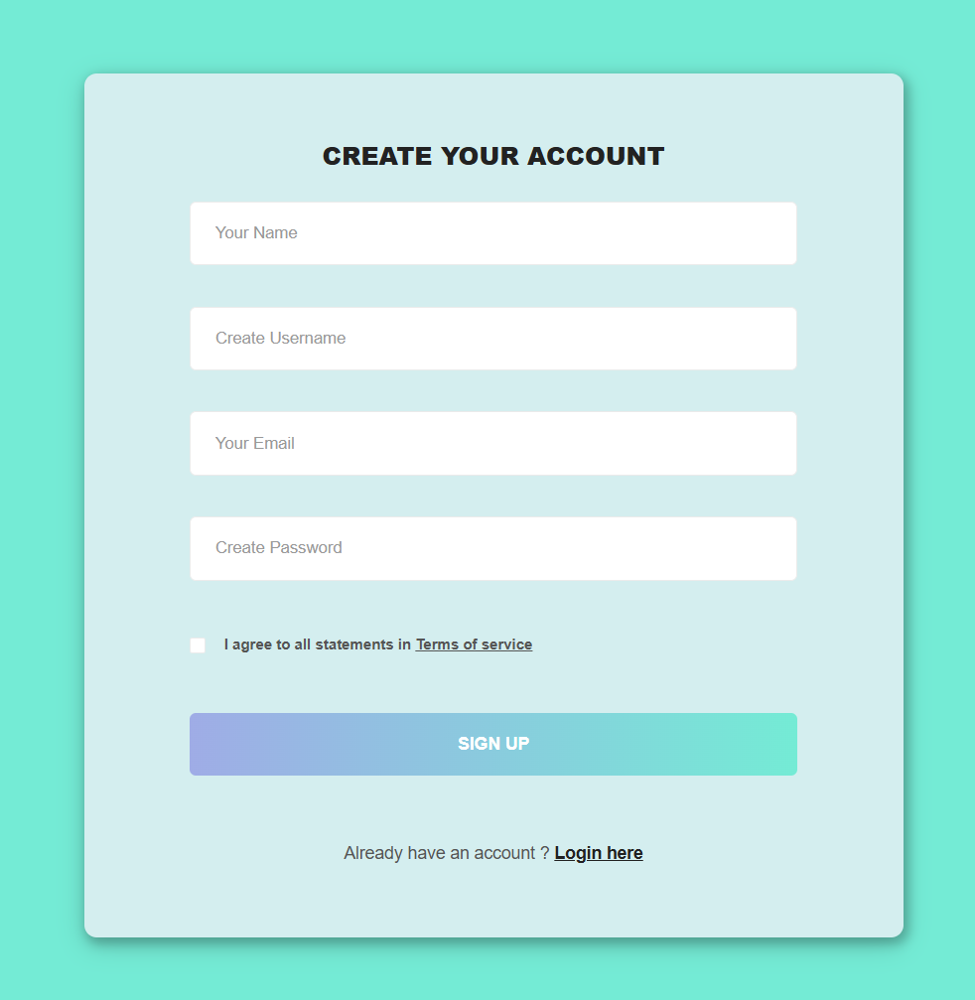
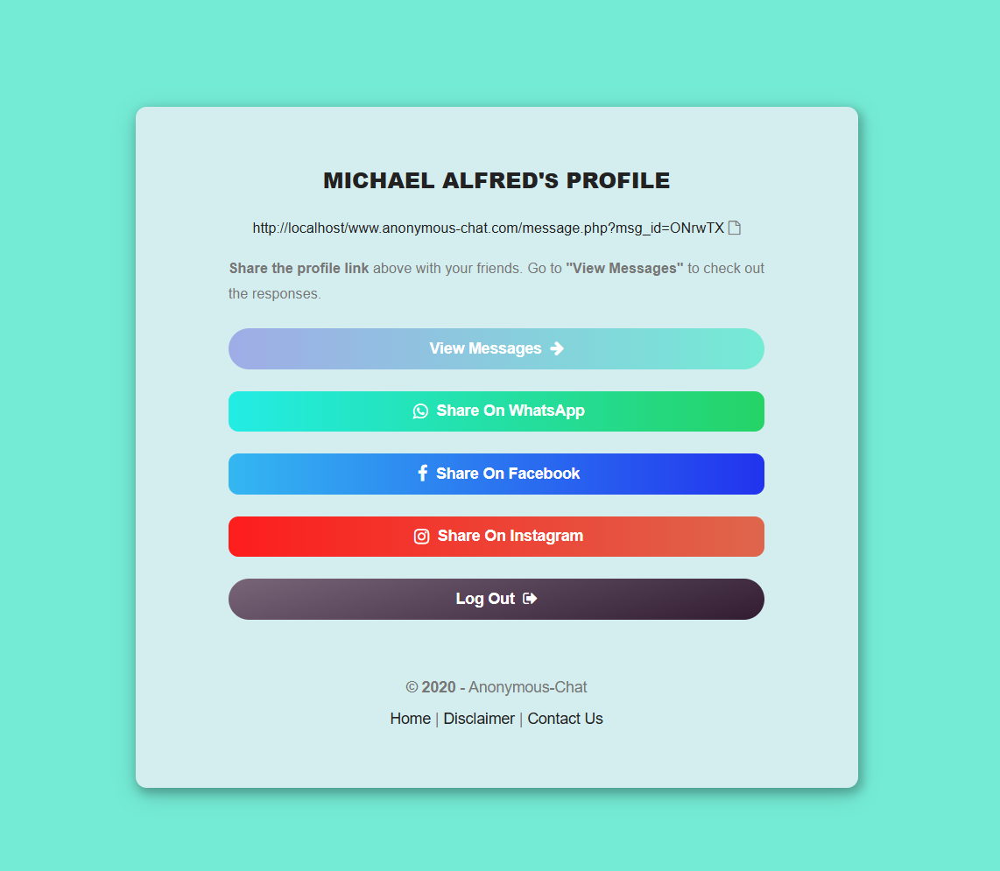
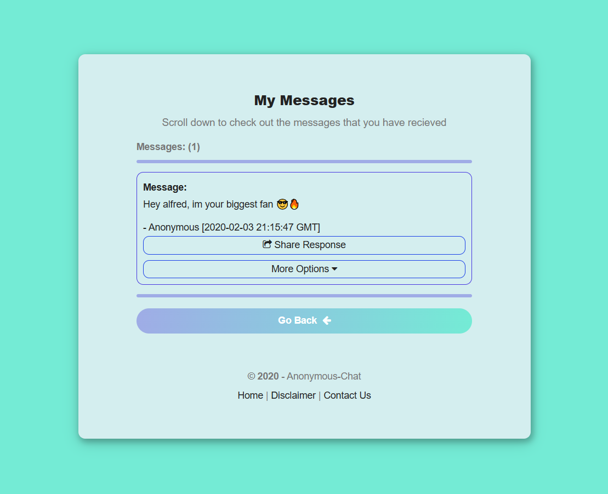
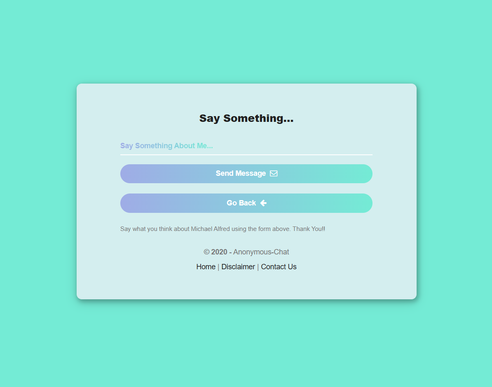

# Anonymous-Chat &nbsp; 

Anonymous Chat is an anonymous messaging web app built using PHP and MySQL. This is an old project of mine from 2020 when I was a beginner in web development. It features a complete dashboard to monitor every aspect of the app. Feel free to try it out!

## How to Run
1. Clone the repository to your local machine.
2. Install XAMPP on your PC and start Apache and MySQL.
3. Import the database into PhpMyAdmin. The SQL file can be found in the `db` folder.
4. Open the project folder in your browser via [http://localhost/your-project-folder](http://localhost/your-project-folder).

## Screenshots

### Login Page

### Register Page

### Profile Page

### View Messages Page

### Message Page

## Tech Stack
- HTML5
- CSS3
- Bootstrap
- jQuery
- PHP
- MySQL
- XAMPP
- No build tools
- No frameworks

## Features
- Responsive layout
- Multi-page website structure
- Clean and simple UI design
- Bootstrap-based grid system
- User authentication and account creation
- Anonymous messaging
- Admin dashboard for managing users

## Project Status
This project is no longer actively maintained. It exists as an archive of my web dev work from 2020.

## What I’d Do Differently Today
- Replace jQuery with modern JavaScript or a framework like React
- Use CSS Grid and Flexbox more extensively
- Improve accessibility (ARIA, keyboard navigation)
- Optimize assets and performance
- Refine the user interface with better color schemes and design themes

## License
This project is for educational and demonstration purposes.
